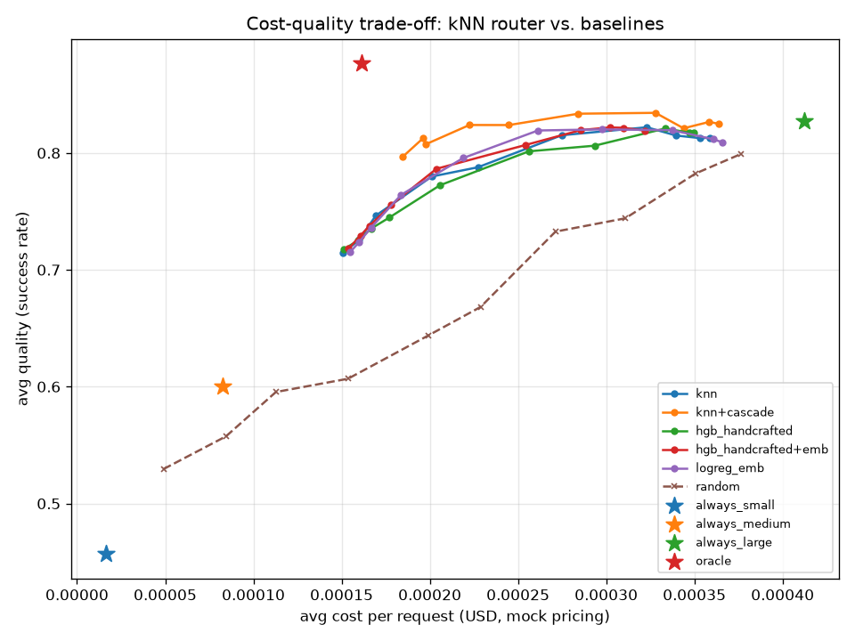
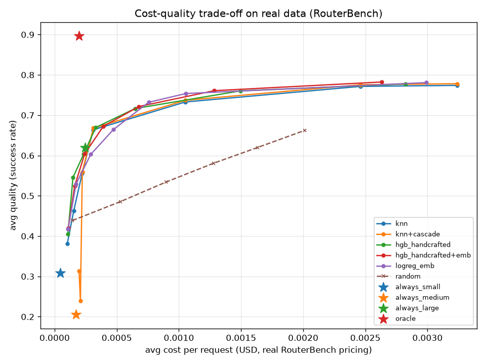

# Non-LLM Model Router: Design, Evaluation, and Results

## 1. Prior work

- **RouteLLM** (Ong et al.) trains lightweight routers (similarity-weighted kNN among them) on human preference data to pick between a strong and weak model, showing large cost cuts at small quality loss. This design borrows the same core move: predict per-model quality, not a model label, and let a threshold rule do the picking.
- **RouterBench** established a standardized cost-quality benchmark across many models/routers. This design's cost-quality-curve evaluation methodology (sweep a knob, plot cost vs. quality, compare AUC) mirrors it directly.
- **CARROT** frames routing as a cost-aware regret-minimization problem rather than pure accuracy maximization — taken here as the reason `quality_target`/utility mode exist as two decision rules instead of one fixed threshold.
- **"When Simple kNN Beats Complex Learned Routers"** (arXiv 2505.12601) is the direct inspiration for making kNN the primary router: it shows a similarity-weighted nearest-neighbor estimator matches or beats trained classifiers, with no retraining step. This design's whole `experience_store` + `knn_router` pair exists to test that claim on synthetic data.
- **"The Routing Plateau"** (arXiv 2606.07587) argues routers plateau on instance-specific hard queries, and post-hoc signals (verification, escalation) are the lever beyond that ceiling — the reason for the verifier/cascade layer on top of kNN, not just a fancier router.
- **FrugalGPT-style cascades** motivate `verifier.py`: a cheap, non-LLM check on the response (truncation, refusal, JSON validity, logprob) that triggers a single escalation, rather than trying to make the router itself perfect.

## 2. Design

```
prompt ──▶ embed (ONCE) ──┬──▶ semantic cache lookup (existing L1/L2) ──▶ HIT? → serve
                           │
                           └──▶ knn_router.route(prompt, embedding, quality_target)
                                   │
                                   ├─ neighbors := experience_store.neighbors(embedding)
                                   ├─ per model m: p_hat[m] = shrunk similarity-weighted estimate
                                   │     p_hat = (α·prior_m + Σ w·y) / (α + Σ w),  w = exp((sim-1)/τ)
                                   ├─ low-confidence (max_sim < ood_sim OR ESS < min_ess)?
                                   │     → fallback_tier (medium), reason=fallback_ood
                                   └─ else: cheapest model with p_hat ≥ quality_target
                                          (or utility argmax in utility mode)
                                   ▼
                         cascade_generate(chosen_model)
                                   │
                          verify_response() fails? ──▶ escalate ONE tier, retry once
                                   │
                                   ▼
                     store in cache + experience_store outcome (verifier failures)
                                   │
                     judge.maybe_judge() samples 20% off the hot path,
                     writes quality_score back — usable as a neighbor immediately,
                     no retrain
```

Key decisions:
- **One embedding, two uses.** `cache_engine.get_or_generate` computes `embedding_service.embed(prompt)` once and passes the same vector into both the FAISS cache lookup and `knn_router.route`. Verified in `test_embedding_computed_once_per_request` via a spy on the embed call.
- **Router memory is separate from the cache.** `experience_store` is its own SQLite table + FAISS index (`routing_outcomes`), because outcomes never expire the way cache entries do, and a query can carry outcomes for several models while the cache only ever holds one served answer.
- **Routing reads never touch SQLite.** The naive design (re-query SQLite for every neighbor's outcomes and for each model's global success rate, on every routing call) turned into dozens of scans per decision and blew the 10ms p95 target by ~2.5x (26ms measured). Fixed by mirroring outcomes and per-model running sums fully in memory, rebuilt once at startup; SQLite is now write-only on the hot path. p95 dropped to ~0.7ms at 5,000 entries.
- **`quality_score` gates the cache, not just routing.** A cache entry judged bad (`quality_score < pass_mark`) is skipped at lookup time regardless of prompt/context similarity — a cheap-model mistake can't get baked into the cache forever.
- **`model="auto"` buckets on intent, not outcome.** The cache bucket hashes `(system_prompt, "auto", temperature, quality_target)`, not the model that actually served the request, so the same cached answer is reusable across different routing outcomes for the same intent.

## 3. Results

Dataset: 3,037 synthetic prompts, 1,000 paraphrase-cluster groups, 8 task families (`sim/generate_routing_dataset.py`, seed 42). Split 80/20 **by group_id** (train=2,431, test=606) — paraphrases never cross the split.

### Cost-quality summary (test split, `eval/results/summary.csv` / `derived_metrics.csv`)

| router | best quality | cost @ best | normalized AUC | cost to reach 95% of always-large | routing p95 (ms) |
|---|---:|---:|---:|---:|---:|
| **knn+cascade** | 0.834 | $0.000328 | **0.813** | **$0.000185** | ~1.5–2.0 |
| hgb_handcrafted+emb | 0.822 | $0.000302 | 0.773 | $0.000204 | ~12–13 |
| logreg_emb | 0.820 | $0.000297 | 0.771 | $0.000219 | <1 |
| knn | 0.822 | $0.000323 | 0.769 | $0.000227 | ~1.5–2.0 |
| hgb_handcrafted | 0.821 | $0.000333 | 0.768 | $0.000256 | ~12–13 |
| random (cost-matched sweep) | 0.799 | $0.000376 | 0.666 | $0.000376 | ~0 |
| always_small | 0.457 | $0.0000165 | — | never | 0 |
| always_medium | 0.600 | $0.0000824 | — | never | 0 |
| always_large | 0.827 | $0.000412 | — | $0.000412 | 0 |
| oracle (hindsight) | 0.877 | $0.000161 | — | $0.000161 | 0 |



**Online-learning experiment** (kNN bootstrapped on 10% of train groups, live judge@20%, vs. HGB trained once on the identical 10% and never updated): kNN reached avg quality **0.770** vs. HGB's **0.689** over the same 606-request replay, at a modestly higher avg cost ($0.000267 vs. $0.000190) — see `eval/results/online_learning.png`. The gap is visible from early in the stream and widens as kNN accumulates judged outcomes the frozen HGB never sees.

**Full-system replay** (real cache + real router, 5,063 requests with paraphrase/exact repeats, via `get_or_generate(model="auto")`, `eval/results/full_system.json`): cache hit rate **96.2%**, escalation rate **14.1% of misses** (191 misses, 27 escalated), quality **0.704**, total cost **$0.0384** vs. an always-large/no-cache baseline of **$2.09** — a **98.2%** cost reduction. Routed-model split among misses: 64% medium / 36% large; small was essentially never chosen (router stayed cold — see limitations).

## 4. Honest limitations

- **Synthetic data encodes our own skill assumptions.** The per-family, per-model skill matrix in `sim/generate_routing_dataset.py` was hand-picked to make small good at families 1–3, medium add 4–5, large needed for 6–8. Every result above is a statement about how well each router recovers a *known, designed* structure, not evidence about real model behavior.
- **Judge labels are noisy by construction**, not just in principle: quality is `label + N(0, 0.08)` noise, and the mock verifier only catches ~60% of true failures (truncation/logprob signals), missing the rest by design — mirroring a real non-LLM verifier's blind spot for confidently-wrong answers.
- **Selection bias, no exploration in the main runs.** `epsilon=0.0` in production defaults means the router never tries a cheaper model it isn't already confident about — it can only get more confident about models it already routes to. The full-system replay shows this concretely: with only 191 real misses (96% cache hit rate) and 20% judge sampling on top of that, the router got roughly ~38 real learning signals across an 8-family workload and never accumulated enough evidence to trust `mock-small` at all. **High cache hit rates and online-learning routers are in tension** — the more the cache works, the less the router gets to learn. Exploration (`epsilon > 0`) or shadow sampling would address this but weren't enabled here.
- **kNN memory grows unboundedly.** `experience_store` never prunes; at real traffic scale this needs clustering/decay (e.g., keep only the top-k representative outcomes per neighborhood, or time-decay old ones) — not implemented here.
- **AUC is a synthetic-dataset-specific number.** It's normalized to this dataset's own cost range for comparability across routers, not to any external, absolute scale.

## 5. Reproduce

```powershell
cd C:\Users\HP\semantic-cache
.\venv\Scripts\python.exe sim\generate_routing_dataset.py
.\venv\Scripts\python.exe -m pytest tests\test_routing.py -v
.\venv\Scripts\python.exe eval\run_routing_eval.py
```

Regression check (unaffected by this feature):
```powershell
Remove-Item -Recurse -Force data -ErrorAction SilentlyContinue
.\venv\Scripts\python.exe tests\test_context_cache.py
.\venv\Scripts\python.exe tests\test_template_cache.py
Remove-Item -Recurse -Force data -ErrorAction SilentlyContinue
.\venv\Scripts\python.exe tests\test_context_aware.py
```

---

## 6. Real-Data Validation (RouterBench)

**What RouterBench is, and how it differs.** [RouterBench](https://arxiv.org/abs/2403.12031) (`withmartian/routerbench` on HuggingFace) records real outcomes from **11 real LLMs** (GPT-4, GPT-3.5, Claude v1/v2/instant, Mixtral, Llama-2-70B, WizardLM, Yi-34B, Mistral-7B, CodeLlama-34B) on **~36,500 real prompts** spanning 86 real benchmark categories (MMLU subsets, GSM8K, HellaSwag, ARC, MT-Bench, and more), with real per-inference cost. It has no paraphrase clusters, no repeated/similar traffic, and no live generation — every outcome is pre-recorded, so this track **cannot validate the cache/router interaction** and the cascade has no real verifier signal to work with (see below). It exists purely to check: given a real, heterogeneous prompt, does the router's *estimation* still hold up outside a designed, monotone synthetic skill matrix.

Setup: `load_routerbench.py` melts RouterBench into the project's long format (401,467 prompt×model rows → 36,497 unique prompts after fixing a real column-naming bug in the original script — performance scores are stored as bare `<model>` columns, not `<model>|performance`). Split 80/20, **stratified by `eval_name`** at the prompt level (so no prompt's outcomes cross the split) — every one of the 86 categories is represented in both sides in close to its original proportion (train=29,199, test=7,298; full per-category counts in the script's own output). All real-data experience-store/embedding-cache files live under `data/routing_real/`, fully isolated from both the synthetic eval's store and the production `data/cache.db`/`data/cache.index` — verified untouched by mtime check in `tests/test_routing_real.py`.

**Cascade caveat, stated plainly.** RouterBench has no `finish_reason`/logprobs — there's no live generation to inspect. So `knn+cascade` here uses a **confidence-gated** escalation instead of the synthetic track's response-shape verifier: escalate one tier whenever the router's own `p_hat` for its chosen model is below 0.5, decided at routing time, before the (frozen) outcome is even looked up. This is a materially weaker signal than a real verifier, and — as the results below show — it shows.

### Real-data summary (`eval/results/real_summary.csv`)

| router | best quality | cost @ best | normalized AUC | cost to reach 95% of always-large |
|---|---:|---:|---:|---:|
| **hgb_handcrafted+emb** | 0.782 | $0.00263 | **0.738** | $0.000242 |
| hgb_handcrafted | 0.778 | $0.00282 | 0.734 | $0.000233 |
| logreg_emb | 0.781 | $0.00299 | 0.732 | $0.000290 |
| knn | 0.774 | $0.00324 | 0.724 | $0.000311 |
| knn+cascade | 0.778 | $0.00324 | 0.721 | $0.000312 |
| random | 0.662 | $0.00201 | 0.592 | $0.001633 |
| always_small (mistral-7b) | 0.309 | $0.0000459 | — | never |
| always_medium (code-llama-34b) | 0.205 | $0.000172 | — | never |
| always_large (gpt-3.5-turbo) | 0.620 | $0.000244 | — | $0.000244 |
| oracle (hindsight, real cost) | 0.897 | $0.000198 | — | $0.000198 |



Notable real-data quirk: `always_medium` (0.205) scores *below* `always_small` (0.309). Tiers are assigned by real average cost, and the cheapest "medium"-tier model happens to be CodeLlama-34B-Instruct — a code specialist that performs poorly on RouterBench's general mix (MMLU/GSM8K/HellaSwag, mostly non-code). Cost and quality don't track cleanly by tier in real data the way the synthetic skill matrix was designed to.

**Per-category breakdown** (`eval/results/real_per_category.csv`, all 86 categories; `knn+cascade` vs `hgb_handcrafted+emb` vs `always_large`): the advantage over `always_large` is real but uneven — near-total quality recovery on large categories like `hellaswag` and `arc-challenge` (both routers reach ~0.98 vs. always-large's ~0.84), essentially no headroom on already-easy or tiny categories (several MMLU subsets and the sub-20-row Chinese-language categories show both routers matching `always_large` exactly, or in a couple of tiny categories doing 5-10 points worse), and one clear split: `hgb_handcrafted+emb` beats `knn+cascade` on quality in the majority of categories where they differ, consistent with the aggregate table.

### Synthetic vs. real comparison (`eval/results/synthetic_vs_real_comparison.csv`)

| router | synthetic AUC | real AUC |
|---|---:|---:|
| knn+cascade | **0.813** (best) | 0.721 (worst of the 5) |
| hgb_handcrafted+emb | 0.773 | **0.738** (best) |
| logreg_emb | 0.771 | 0.732 |
| knn | 0.769 | 0.724 |
| hgb_handcrafted | 0.768 | 0.734 |
| random | 0.666 | 0.592 |

**Spearman rank correlation (synthetic AUC vs. real AUC, n=6): ρ = 0.257 (p = 0.623).** Not statistically significant — the router ranking essentially does not transfer.

**Does the earlier verdict hold? No — it does not replicate, and on the one claim that mattered most, it reverses.** The synthetic-data finding was "plain kNN ≈ tied with HGB, and `knn+cascade` wins clearly via the cascade specifically." On real data: plain kNN is still roughly in the same neighborhood as the HGB baselines (0.724 vs. 0.734–0.738 — a small, consistent gap now, HGB modestly ahead rather than tied), but **`knn+cascade` is the worst of the five non-trivial routers**, not the best — the cascade *cost* about 0.003 AUC instead of adding 0.04. The cost-quality curve shows why directly: `knn+cascade`'s low-`quality_target` points dip to 0.24–0.32 quality, well below plain `knn`'s 0.38–0.46 at similar cost. Most likely explanation: at a low `quality_target`, the router correctly picks a cheap model whose real `p_hat` is often still under 0.5 — triggering the confidence-gated cascade on nearly every request regardless of the user's actual cost intent — and the escalation target is "the cheapest model in the next tier up," which, per the tier/quality misalignment noted above, can land on a *worse*-performing model (CodeLlama again) than the one just abandoned. A synthetic-only conclusion that the cascade is an unqualified win would not have survived contact with real, non-monotone tier-cost-quality relationships — this is exactly the kind of divergence the exercise was built to surface.

### Updated limitations

- **No cache/router interaction validated here.** RouterBench has no repeated or paraphrased traffic, so this track says nothing about cache hit rate, escalation-in-production, or the full-system numbers from Section 3 — those remain synthetic-only claims.
- **The cascade's escalation trigger is not the same mechanism as the synthetic track's**, and is demonstrably weaker (see above) — a confidence threshold on the router's own estimate is not a substitute for inspecting an actual generated response.
- **RouterBench's model pool and pricing are 2024-era** and don't correspond to this project's own mock three-tier cost structure; `load_routerbench.py`'s tier assignment (bottom/middle/top third by real average cost) is a proxy applied post-hoc, not a designed cost tier the way the synthetic dataset's was.
- **Category imbalance is real and uncorrected** beyond stratification: `hellaswag` (10,042 rows) and `grade-school-math` (7,450) together are ~48% of the dataset; the aggregate AUC numbers are effectively dominated by performance on those two categories, which the per-category CSV makes possible to check but which the headline table does not correct for.

### Reproduce

```powershell
cd C:\Users\HP\semantic-cache
.\venv\Scripts\python.exe load_routerbench.py
.\venv\Scripts\python.exe -m pytest tests\test_routing_real.py -v
.\venv\Scripts\python.exe eval\run_routing_eval_real.py
```
Note: the full run embeds ~36.5k prompts and fits 11-model classifiers on ~29k rows — expect on the order of an hour on a single machine (the embedding step and the two HGB variants dominate). Embeddings are cached to `data/routing_real/embeddings.npy` after the first run.
